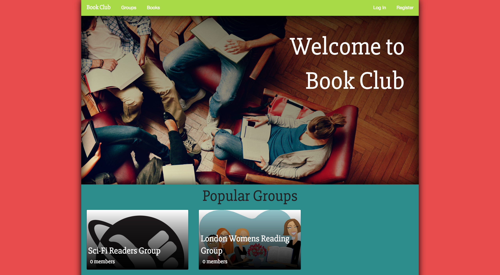

The brief for our second project on the WDI was to produce a rails app with 3 or more linking models in a week. I chose to make a book club app by which people could find clubs discussing books/genres they are interested in. I had never used Ruby before joining General Assembly, so I was happy to produce a functioning RESTful app in the time provided.

