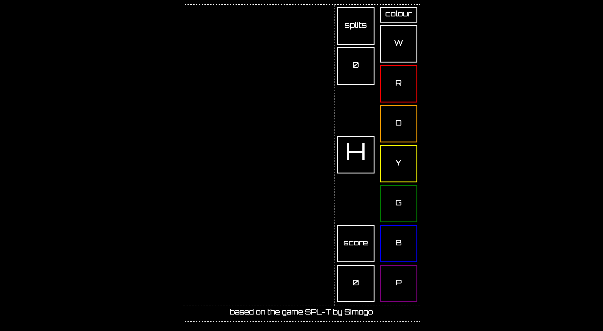

Split was my first project on the WDI course at General Assembly. We had 4 days to make a 1 page front-end JavaScript game.

I chose to make a clone of the game [SPL-T](http://simogo.com/work/spl-t/), a high-score puzzle game by Simogo. The game involves splitting rectangles in half in order to match 4 or more similar shapes. As you make matches your score increases, and the game ends when there are no more splits available.

Although we only began this project two weeks into the course, I had had a little JavaScript experience prior to starting the WDI, so I felt somewhat in my comfort zone. I love working with complex functions, and creating the game logic for this was great fun.

